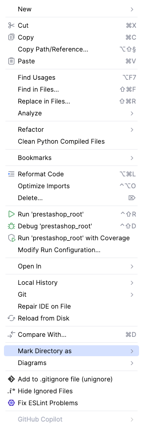

# Docker-platforms - Shopware

### 1 - Running for the first time
```bash
    ./run.sh
```
This script will clone the necessary repository and build the necessary docker images to start the containers.
The base image for Shopware 5 is available on the Dockerfile within this directory.

This will take a while to finish, and only after shopware has been completely installed and the Nosto extension enabled, you'll see the shop on the browser. 

You can follow the shopware container logs by running:
```bash
    docker composer logs -f shopware
```
### 2 - Code quality tools

To run the code quality tools, you can run the following commands:
```bash
    docker compose run --rm composer install
    docker compose run --rm phan
    docker compose run --rm phpcs
    docker compose run --rm phing {VERSION}
```
They are defined at `docker-compose.yml`, uncomment when needed, or they'll run by default when you don't pass args to `docker composer up`.

### 3 - IDE completion:
Running the script below, will do a copy of the shopware root from the container to the host machine.
```bash
  ./copy_root_to_host.sh
```
If you're using IDEA, you can set the `shopware_root` as a source root to get code completion.
Just right click on shopware_root (and/or shopware8_root) and select `Mark Directory as` -> `Sources Root`



### 4 - Pointing to local playcart instance
On the `docker-compose.yml`, you can set your local playcart environment.
If you choose to run on a different domain, you can update the following env vars:
```
NOSTO_SERVER_URL
NOSTO_API_BASE_URL
NOSTO_OAUTH_BASE_URL
NOSTO_WEB_HOOK_BASE_URL
NOSTO_IFRAME_ORIGIN
NOSTO_IFRAME_ORIGIN_REGEXP
```
Leaving those empty will point to production by default.

### 5 - Accessing UI

[NOTE]: shopware should be available on `http://shopware.dev.nos.to:8081`
Admin credentials are:
User: `admin`
Password:`Admin12345`
Backend URL: `http://shopware.dev.nos.to:8081/backend`
